# kubeflow-example
This repo is intended to provide an example of training a ml model (in this case the training iris flower data on RandomForestClassifier model) and deploying it to a multi model server (with triton serving runtime) using Red Hat Openshift AI's (RHOAI) DataSciencePipelines. The implementation uses python and the KubeFlow Pipelines (KFP) SDK to either compile the pipeline to IR or submit it directly to the pipeline server for execution.

## Assumptions
1. This example exercise will be ran in RHOAI (at least 2.16).
1. The training presupposes the use of small inline iris dataset and the RandomForestClassifier model. If you want to switch out the dataset and model used please make code changes to `pipelines/iris_training_pipeline.py`
1. Except for KUBEFLOW_ENDPOINT and BEARER_TOKEN the environment variables in the .env file will be sufficient for your case. Otherwise please change them.

## Prerequisites
1. The user has access to RHOAI Dashboard

## Environment Preparation Instructions

We will need a few resources in place in our Data Science Project in order to run the pipeline and have it deploy our model onto an inference service. Please follow these instructions before proceeding to the main instructions.

1. Create a data science project to house the resources we will be creating. In my case I created the project `fharo-testing`. If you do not have access to create projects on the RHOAI Dashboard ask your RHOAI cluster administrator to create one for you.
1. Under your Data Science Project view > Connections: Create a data connection of Connection type `S3 compatible object storage - v1` with the form filled out like so.: 
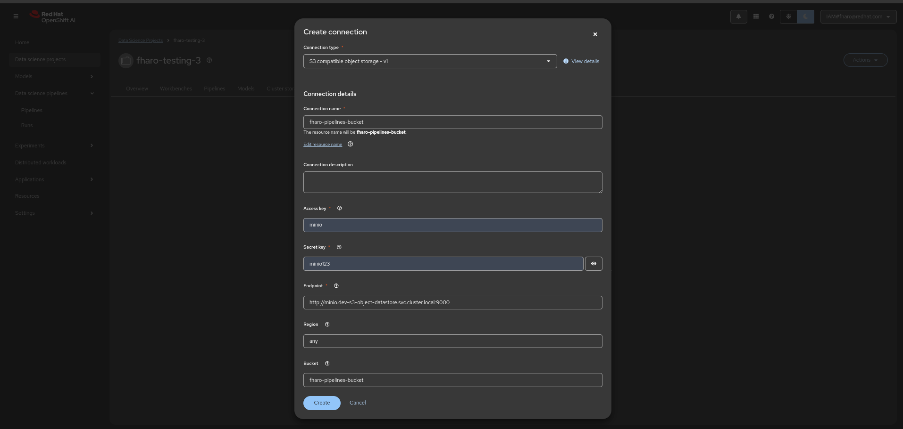
*Note: This connects our pipeline server to s3 where it will store the iris model. But this connection also gets used by the inference server that our pipeline deploys to.*
1. Next create the data science pipeline server. Click on the Pipelines section under your datascience project. Click on the `Configure pipeline server` button and fill out the form (as shown below) and finally click on `Configure pipeline server` form button: 
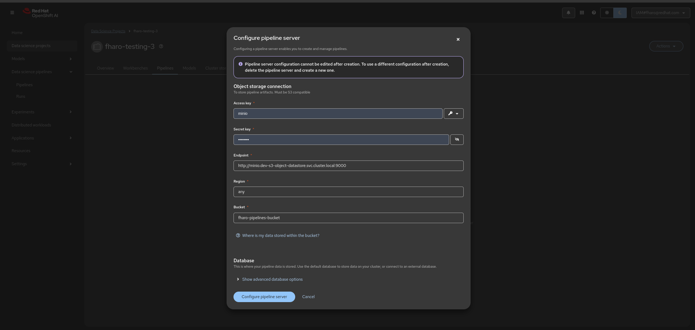
*Note: If you click on the key icon it will load the information from our data connection created earlier into the pipeline server configuration.*
1. After a few minutes of waiting for the pipeline server to come up, you should
see a `Import pipeline` button indicating it is ready to import pipelines.
1. Now lets setup a model server (which our pipeline will later deploy an inference service to it). Under the `Models` section under your data science project click on `Select multi-model` button. Then click `Add model server` button. Fill out the form as follows and click the `Add` button:
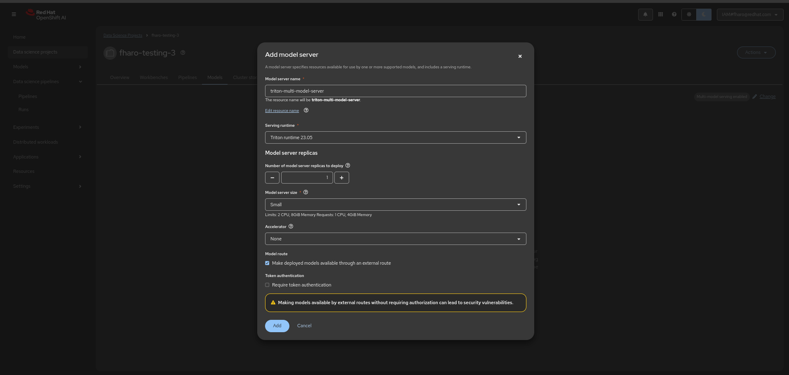
*Note: For simplicity you can uncheck "Require token authentication".
1. Now lets setup a workbench that we can later use to run interactive python notebook file to test out our pipeline's deployed model. Under the `Workbenches` section click on `Create workbench` button. Name it `test-iris-model-server` and `Standard Data Science` for the Image selection and leave the rest of the form alone like the picture below. Click on `Create workbench`:
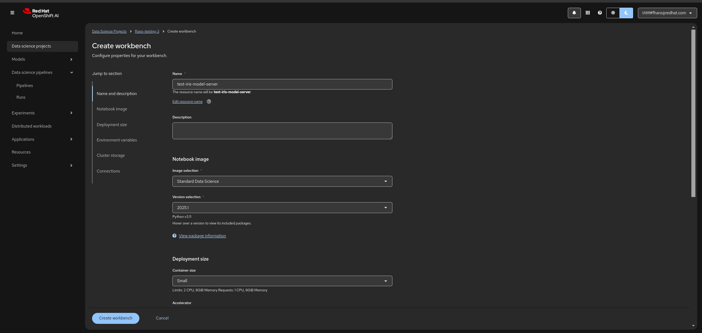

Your environment should be all ready to go. Now we can start running the pipeline example.

## Main Instructions
1. After your workbench is started, open it. Allow selected permissions if first time opening it.
1. Clone this repository into it by clicking on the Git button on the left panel and then clicking on the `Clone a Repository` button. Put the git http url in the form and click `Clone` button like the picture below:
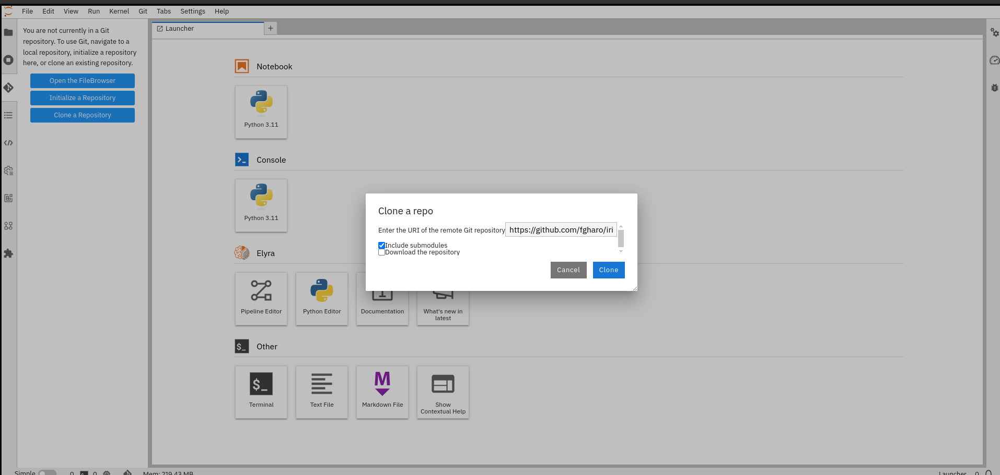
1. After the git clone, open the iris-ml-model-training-pipeline-example-on-rhoai/pipelines/iris_training_pipeline.py file and change line 336 to be the name of your particular Data Science Project.
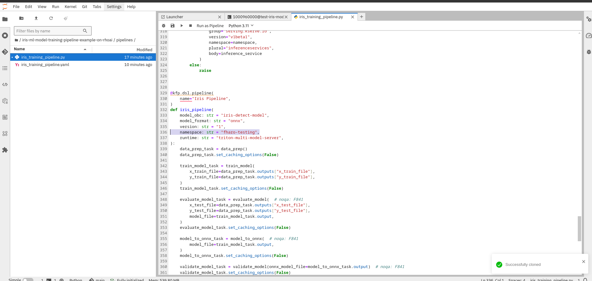
1. Next click on the `Terminal` button on the `Launcher` tab.
1. In the terminal window that opens up, navigate to the cloned repository. `cd iris-ml-model-training-pipeline-example-on-rhoai`
1. Execute `python pipelines/iris_training_pipeline.py`. Notice a new file under pipelines folder called `iris_training_pipeline.yaml`. 
1. Right click the yaml file and select download. This will download to your machine.
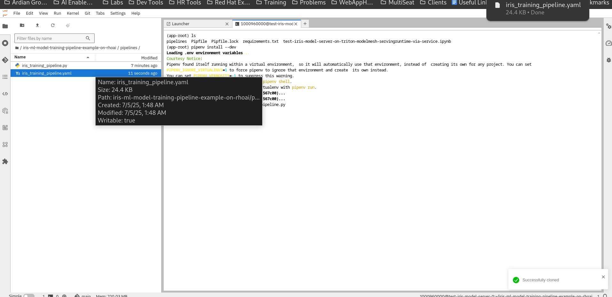
1. Navigate back to your datascience project in Red Hat Openshift AI Dashboard.
1. Click on `Pipelines` section. 
1. Click on `Import pipeline`.
1. Upload the downloaded yaml file `iris_training_pipeline.yaml` by clicking on the `Upload` button. Your screen should look like this:
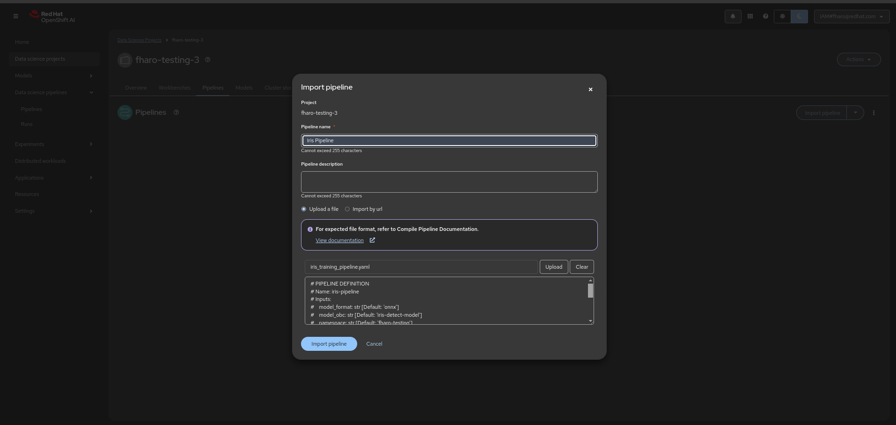
1. You will be redirected to a graphical view of your pipeline. The top is the start and the bottom is the end.
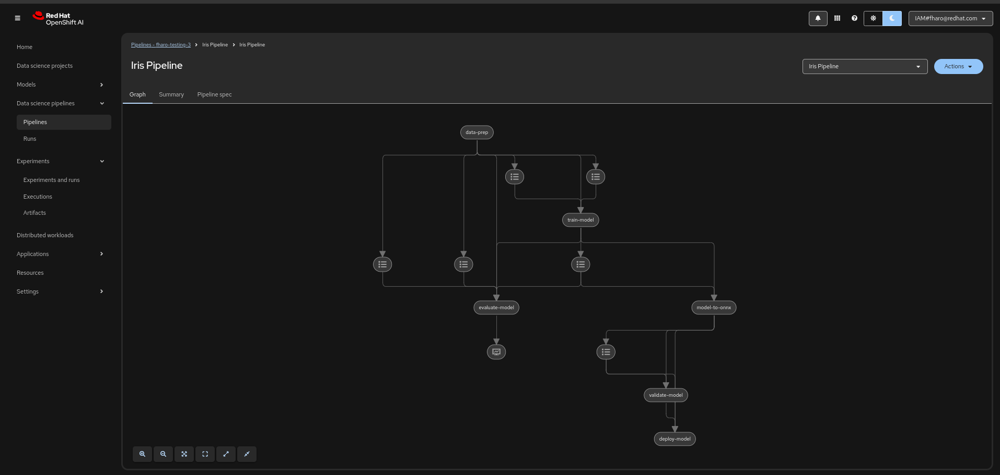
1. To run this pipeline click `Actions` then `Create Run` option. A form will come up. Click on `Create new experiment` button, name it `Iris Experiment` and click `Create experiment` button. Name the run `Iris run 1` and click on `Create run` button to submit the form. Leave the rest of the form as is. Notice at the bottom, the parameters match the inputs to our pipeline decorated function in our `iris_training_pipeline.py` file. The form should look like so:
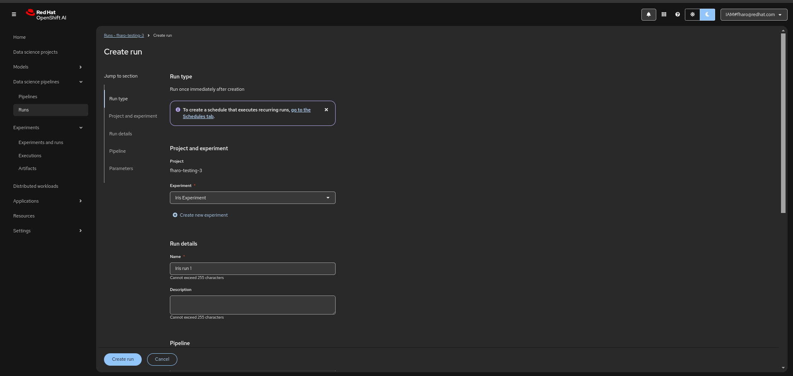
1. Notice that the first run of the pipeline fails at the last task:
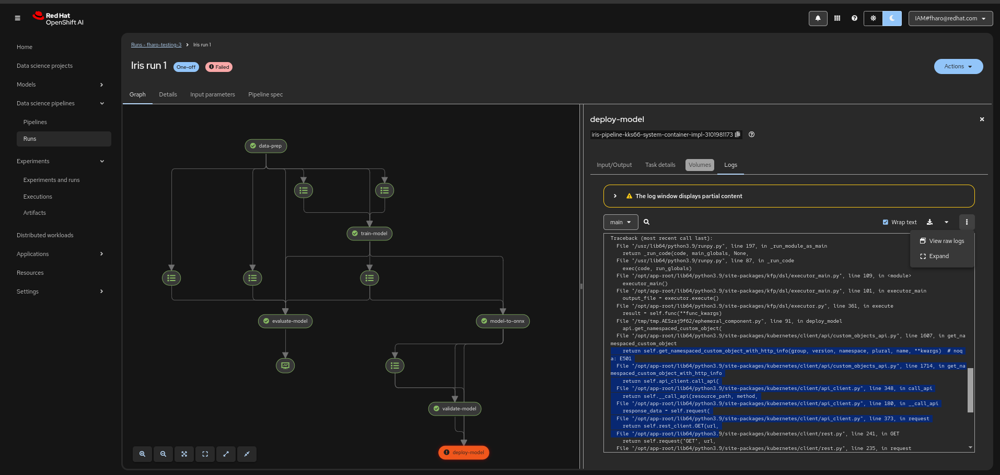
1. This is because RHOAI runs on Openshift and Openshift has RBAC rules that dictate who can do what on the cluster. In this case, the pipeline server ran your pipeline, creating a new container/pod (i.e. a container is a linux process and a pod is a openshift/kubernetes object) for each of the pipeline components (i.e. the python functions that are decorated with @component in our `iris_training_pipeline.py` file) and the component or container for `deploy-model` task tried to deploy a model onto the triton mult model server. This action requires a special role to do anything with inferenceserver's (e.g. get, create, update, etc). If you click on the visual node named `deploy-model` the error logs read:
```
Applying Inference Service Configuration:
{
    "apiVersion": "serving.kserve.io/v1beta1",
    "kind": "InferenceService",
    "metadata": {
        "name": "iris-detect-model",
        "namespace": "fharo-testing-3",
        "annotations": {
            "serving.kserve.io/deploymentMode": "ModelMesh",
            "openshift.io/display-name": "iris-detect-model"
        },
        "labels": {
            "opendatahub.io/dashboard": "true"
        }
    },
    "spec": {
        "predictor": {
            "model": {
                "runtime": "triton-multi-model-server",
                "modelFormat": {
                    "name": "onnx",
                    "version": "1"
                },
                "storage": {
                    "key": "fharo-pipelines-bucket",
                    "path": "iris-pipeline/02924d2b-e733-464e-964f-a29e4c2a13f3/model-to-onnx/da06a45e-1e86-47f3-b4f8-5d34a5e3804e/onnx_model_file"
                }
            }
        }
    }
}
Traceback (most recent call last):
  File "/usr/lib64/python3.9/runpy.py", line 197, in _run_module_as_main
...
kubernetes.client.exceptions.ApiException: (403)
Reason: Forbidden
HTTP response headers: HTTPHeaderDict({'Audit-Id': '1803117a-1492-4378-bced-1f236730c029', 'Cache-Control': 'no-cache, private', 'Content-Type': 'application/json', 'Strict-Transport-Security': 'max-age=31536000', 'X-Content-Type-Options': 'nosniff', 'X-Kubernetes-Pf-Flowschema-Uid': '9e8cf274-277d-4ba0-8c0e-9d14bb932d42', 'X-Kubernetes-Pf-Prioritylevel-Uid': 'ddb48ce1-9fa1-40a5-a8fd-c835dded301a', 'Date': 'Sat, 05 Jul 2025 09:09:30 GMT', 'Content-Length': '461'})
HTTP response body: {"kind":"Status","apiVersion":"v1","metadata":{},"status":"Failure","message":"inferenceservices.serving.kserve.io \"iris-detect-model\" is forbidden: User \"system:serviceaccount:fharo-testing-3:pipeline-runner-dspa\" cannot get resource \"inferenceservices\" in API group \"serving.kserve.io\" in the namespace \"fharo-testing-3\"","reason":"Forbidden","details":{"name":"iris-detect-model","group":"serving.kserve.io","kind":"inferenceservices"},"code":403}
```
1. The appropriate thing to do here is have your rhoai cluster administrator to give the service account representing that container/pod the appropriate role. From the logs grab the value after User and fill in the following command along with asking your admin to login to RHOAI on his/her terminal and execute the following command:
```
oc policy add-role-to-user edit system:serviceaccount:<UPDATE ME WITH DATASCIENCE PROJECT NAME>:pipeline-runner-dspa -n <UPDATE ME WITH DATASCIENCE PROJECT NAME>
```
As an actual example:
```
oc policy add-role-to-user edit system:serviceaccount:fharo-testing-2:pipeline-runner-dspa -n fharo-testing-2
```
1. Afterwards, rerun your pipeline by clicking on left panel `Data science pipelines` > `Runs` > `Create run` button. Select the same settings as you had from the first run but select a different run number. I bumped mine to `Iris run 2` with my pipeline selected with the rest of the form values as they are and click `Create run` button. It should look like so:
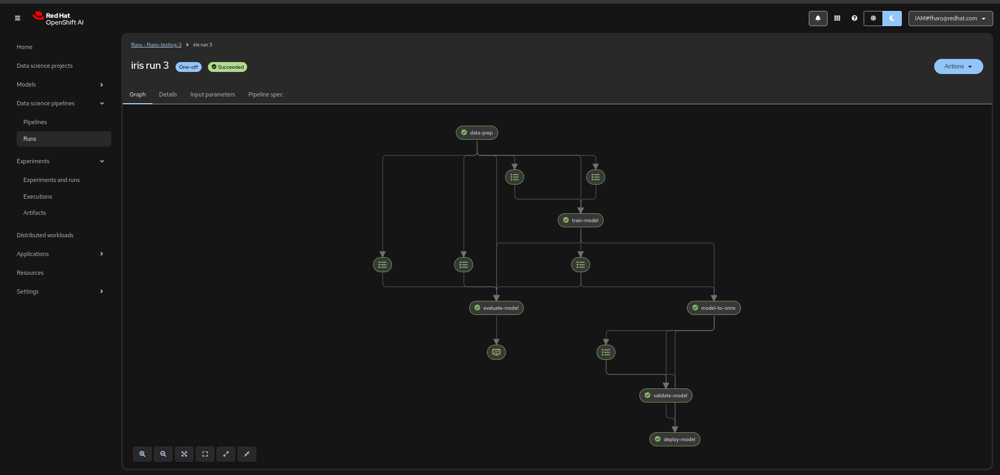
1. Notice the onnx_model_file `path` in s3 in the `deploy-model` task has been updated in the inferenceservice:
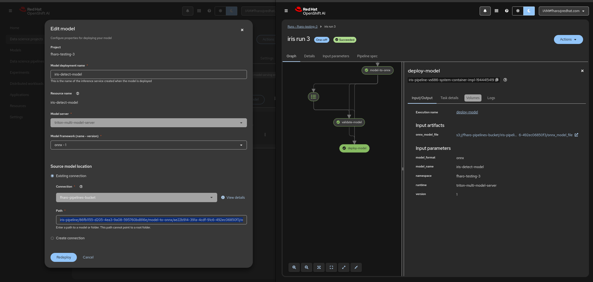
1. Now that our model is deployed, note the internal and external endpoint details as shown below:
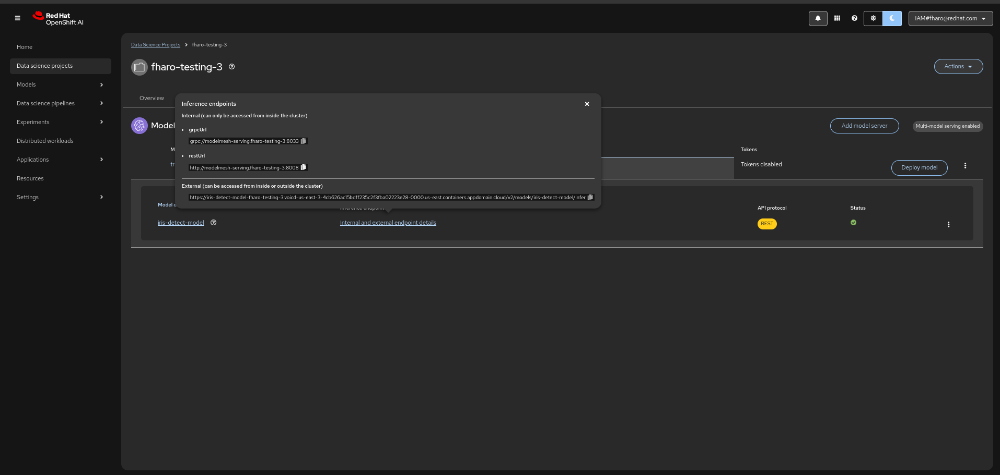
1. Click copy button on the `restUrl`  option.
1. Go back to your workbench and open file `test-iris-model-server-on-triton-modelmesh-servingruntime-via-service.ipynb`.
1. Replace the host python variable with your particular restUrl. Click on the play button to run the whole notebook and you should get a response from the inference server at the bottom cell. This demonstrates that our trained and s3 stored model is on the server.


## Optional Improvement
You can eliminate the step of having to upload the Intermediate Representation (IR) file onto the pipeline server by following these instructions.
1. Open a Terminal from the `Launcher` tab so we can run terminal commands in the subsequent steps.
1. Update the .env file that came with the git repo you cloned for the following respective env vars:
    * Update the `KUBEFLOW_ENDPOINT` url with the final https url output of the following commands:
        ```sh
        route=https://$(oc get route ds-pipeline-dspa -o=jsonpath='{.spec.host}')
        sed -i.bak "s|^KUBEFLOW_ENDPOINT=.*|KUBEFLOW_ENDPOINT=${route}|" .env
        ```
    * Update `BEARER_TOKEN` with the result of getting your token by running the following commands in the terminal:
        ```sh
        token=$(oc whoami --show-token)
        sed -i.bak "s|^BEARER_TOKEN=.*|BEARER_TOKEN=${token}|" .env
        ```
1. You can confirm the environment variables were updated by executing this terminal command: `cat .env` inside of the `iris-ml-model-training-pipeline-example-on-rhoai` directory.
1. Comment this block out from `pipelines/iris_training_pipeline.py`:
    ```
    if __name__ == "__main__":
        kfp.compiler.Compiler().compile(iris_pipeline, package_path=__file__.replace(".py", ".yaml"))
    ```
    *Tip: You can comment out a block of lines in the file editor by highlighting the block you want to comment out and then hitting keyboard combo keys Ctrl+/* 
1. Uncomment lines starting from line 422 til line 456.
    *Tip: You can uncomment a block of lines in the file editor by highlighting the block you want to uncomment and then hitting keyboard combo keys Ctrl+/* 
1. Save the file in the editor.
1. In the terminal execute your python script to submit the pipeline: `python pipelines/iris_training_pipeline.py`
1. Notice that last URL printed in the output. Click on that url and it should
take you to a graphical view of your pipeline run.
1. Once again after all the pipeline tasks are green if you click on the `deploy-model` task and inspect the logs the path should match the inference server path configured in your `triton-multi-model-server`.
1. Now you have a convenient pipeline to start out with that trains a model, uploads the model to s3 and finally deploys said model to a triton multi model server.


## Tips for working with Kubeflow SDK
* Keep execution of the python script with execution of the individual component functions separate in your mind. The former runs in your notebook, the latter runs on the pipeline server. Each function annotated with @component runs in its own separate container or linux process behind the scenes.
* Functions annotated with @component do not have access to the surrounding scope. So if you need an import of a particular module make sure you do an inline import in the component function body. If a module is not in the base_image passed to the decorator than either add that module to `packages_to_install` argument or build your own base image with the python modules added.
* Watch out for functions annotated @pipeline as regular python control flow constructs (if/then, loops, etc) won't compile properly. Prefer kfp dsl constructs (with dsl.If(...), with dsl.ParallelFor(...) as item, etc). If you need to use traditional non-parallel loops nest them in the individual @component decorated functions.
* For more examples and reference documentation, visit the official Kubeflow Pipelines SDK docs: [link](https://kubeflow-pipelines.readthedocs.io/en/latest/index.html): 